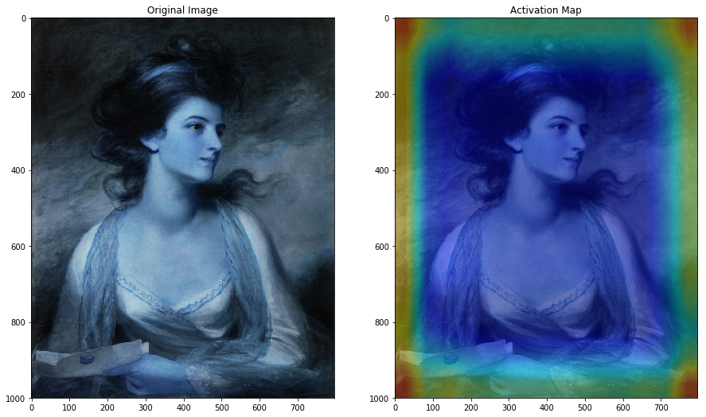

# World-from-the-Eyes-of-CNN

### Heatmap superimposed on original image to evaluate where the CNN is focussing the image in order to distinguish it.
#### Following are the 2 Examples for the same -
 

## Image through convolutional layer , maxpool layer and an activation layer. 

## Image through Conv layer and activation layer only. Notice the edges of the car in the softmax activated feature map.

## Image through Conv layer only.
## Now a bit closer look at the headlights, tyres , grill which have been focussed in this feature map.Notice the car's number plate , how it got bigger, focussed and clearer than before.

